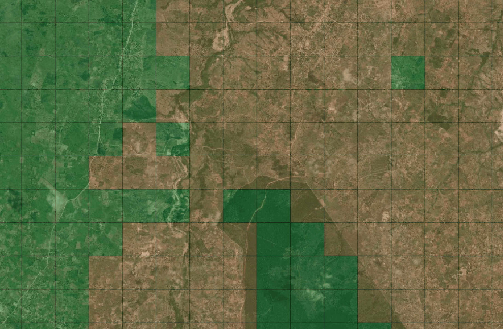

# Label Maker
## Data Preparation for Satellite Machine Learning

The tool downloads [OpenStreetMap QA Tile]((https://osmlab.github.io/osm-qa-tiles/)) information and satellite imagery tiles and saves them as an [`.npz` file](https://docs.scipy.org/doc/numpy/reference/generated/numpy.savez.html) for use in Machine Learning training.


_satellite imagery from [Mapbox](https://www.mapbox.com/) and [Digital Globe](https://www.digitalglobe.com/)_

## Requirements
- [Python 3.6](https://www.python.org/)
- [tippecanoe](https://github.com/mapbox/tippecanoe)

## Installation

```bash
pip install label_maker
```

Note that running this library this requires `tippecanoe` as a "peer-dependency" and that command should be available from your command-line before running this.

## Configuration

Before running any commands, it is necessary to create a `config.json` file to specify inputs to the data preparation process:

```json
{
  "country": "togo",
  "bounding_box": [1.09725, 6.05520, 1.34582, 6.30915],
  "zoom": 12,
  "classes": [
    { "name": "Roads", "filter": ["has", "highway"] },
    { "name": "Buildings", "filter": ["has", "building"] }
  ],
  "imagery": "http://a.tiles.mapbox.com/v4/mapbox.satellite/{z}/{x}/{y}.jpg?access_token=ACCESS_TOKEN",
  "background_ratio": 1,
  "ml_type": "classification"
}
```

- `country`: The [OSM QA Tile](https://osmlab.github.io/osm-qa-tiles/) extract to download. The value should be a country string matching a value found in `label_maker/countries.txt`
- `bounding_box`: The bounding box to create images from. This should be given in the form: `[xmin, ymin, xmax, ymax]` as longitude and latitude values between `[-180, 180]` and `[-90, 90]` respectively. Values should use the WGS84 datum, with longitude and latitude units of decimal degrees.
- `zoom`: The [zoom level](http://wiki.openstreetmap.org/wiki/Zoom_levels) to create images as. This functions as a rough proxy for resolution. Values should be given as integers.
- `classes`: An array of classes for machine learning training. Each class is defined as an object with two required properties:
  - `name`: The class name
  - `filter`: A [Mapbox GL Filter](https://www.mapbox.com/mapbox-gl-js/style-spec#other-filter) to define any vector features matching this class. Filters are applied with the standalone [featureFilter](https://github.com/mapbox/mapbox-gl-js/tree/master/src/style-spec/feature_filter) from Mapbox GL JS.
  - `buffer`: The number of pixels to buffer the geometry by. This is an optional parameter to buffer the label for `object-detection` and `segmentation` tasks. Accepts any number (positive or negative). It uses [Shapely `object.buffer`](https://shapely.readthedocs.io/en/latest/manual.html#object.buffer) to calculate the final geometry. You can verify that your buffer options create the desired labels by inspecting the files created in `data/labels/` after running the `labels` command.
- `imagery`: One of:
  - A template string for a tiled imagery service. Note that you will generally need an API key to obtain images and there may be associated costs. The above example requires a [Mapbox access token](https://www.mapbox.com/help/how-access-tokens-work/)
  - A GeoTIFF file location. Works with both local and remote files. Ex: `'http://oin-hotosm.s3.amazonaws.com/593ede5ee407d70011386139/0/3041615b-2bdb-40c5-b834-36f580baca29.tif'`
- `background_ratio`: For single-class classification problems, we need to download images with no matching class. We will download `background_ratio` times the number of images matching the one class.
- `ml_type`: One of `"classification"`, `"object-detection"`, or `"segmentation"`. For the final label numpy arrays (`y_train` and `y_test`), we will produce a different label depending upon the `type`.
  - `"classification"`: An array of the same length as `classes`. Each array value will be either `1` or `0` based on whether it matches the class at the same index
  - `"object-detection"`: An array of bounding boxes of the form `[xmin, ymin, width, height, class_index]`. In this case, the values are not latitude and longitude values but pixel values measured from the upper left-hand corner. Each feature is tested against each class so if a feature matches two or more classes, it will have the corresponding number of bounding boxes created.
  - `"segmentation"`: An array of shape `(256, 256)` with values matching the class_index label at that position. The classes are applied sequentially according to `config.json` so latter classes will be written over earlier class labels.
- `imagery_offset`: An optional list of integers representing the number of pixels to offset imagery. For example `[15, -5]` will move the images 15 pixels right and 5 pixels up relative to the requested tile bounds.

## Command Line Use

`label-maker` is most easily used as a command line tool. There are five commands documented below. All commands accept two flags:
- `-d` or `--dest`: _string_ directory for storing output files. (default: `'data'`)
- `-c` or `--config`: _string_ location of config.json file. (default `'config.json'`)

Example:
```bash
$ label-maker download --dest flood-monitoring-project --config flood.json
```

### Download

Download and unzip OSM QA tiles

```bash
$ label-maker download
Saving QA tiles to data/ghana.mbtiles
   100%     18.6 MiB       1.8 MiB/s            0:00:00 ETA
```

### Labels

Retiles the OSM data to the desired zoom level, creates label data (`labels.npz`), calculates class statistics, creates visual label files (either GeoJSON or PNG files depending upon `ml_type`). Requires the OSM QA tiles from the previous step. Accepts an additional flag:
- `-s` or `--sparse`: _boolean_ if this flag is present, only save labels for up to `n` background tiles, where `n` is equal to `background_ratio` times the number of tiles with a class label.

```bash
$ label-maker labels
Determining labels for each tile
---
Residential: 638 tiles
Total tiles: 1189
Write out labels to data/labels.npz
```

### Preview

Downloads example satellite images for each class. Requires the `labels.npz` file from the previous step. Accepts an additional flag:
- `-n` or `--number`: _integer_ number of examples images to create per class. (default: `5`)

```bash
$ label-maker preview -n 10
Writing example images to data/examples
Downloading 10 tiles for class Residential
```

### Images

Downloads all imagery tiles needed for training. Requires the `labels.npz` file from the `labels` step.

```bash
$ label-maker images
Downloading 1189 tiles to data/tiles
```

### Package

Bundles the satellite images and labels to create a final `data.npz` file. Requires the `labels.npz` file from the `labels` step and downloaded image tiles from the `images` step.

```bash
$ label-maker package
Saving packaged file to data/data.npz
```

## Using the Packaged Data

Once you have a packaged `data.npz` file, you can use [`numpy.load`](https://docs.scipy.org/doc/numpy/reference/generated/numpy.load.html) to load it. As an example, here is how you can supply the created data to a [Keras](https://keras.io) Model:

```python
# the data, shuffled and split between train and test sets
npz = np.load('data.npz')
x_train = npz['x_train']
y_train = npz['y_train']
x_test = npz['x_test']
y_test = npz['y_test']

# define your model here, example usage in Keras
model = Sequential()
# ...
model.compile(...)

# train
model.fit(x_train, y_train, batch_size=16, epochs=50)
model.evaluate(x_test, y_test, batch_size=16)
```

For more detailed walkthroughs, check out the [examples page](examples)

## Contributing

### Installation

Install in development mode using
```
pip install -e .
```

### Testing

Tests are run using `unittest`. Unit tests are at `tests/unit` and
integration tests are at `tests/integration`.

You can test a single file like:
```
python -m unittest test/unit/test_validate.py
```
or a folder with
```
python -m unittest discover -v -s test/unit
```
Full options [here](https://docs.python.org/3/library/unittest.html)


## Acknowledgements

This library builds on the concepts of [skynet-data](https://github.com/developmentseed/skynet-data). It wouldn't be possible without the excellent data from OpenStreetMap and Mapbox under the following licenses:
- OSM QA tile data
  [copyright OpenStreetMap contributors](http://www.openstreetmap.org/copyright)
  and licensed under
  [ODbL](http://opendatacommons.org/licenses/odbl/)
- Mapbox Satellite data can be
  [traced for noncommercial purposes](https://www.mapbox.com/tos/#[YmtMIywt]).
