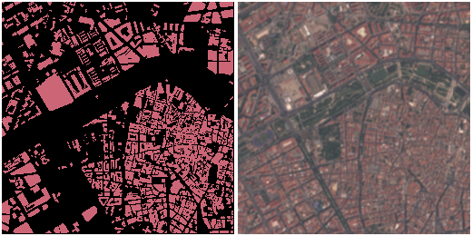
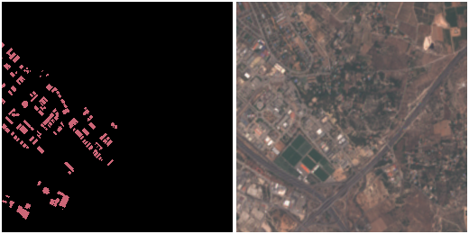
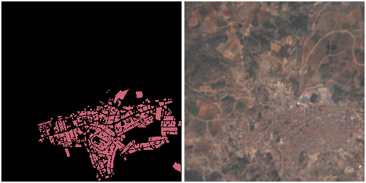

# Preparing Data with Sentinel Hub

[Sentinel Hub](https://www.sentinel-hub.com/) is an easy way to access Sentinel imagery for use in machine learning applications. As an example, here is a configuration file for creating building segmentation masks in Valencia, Spain from Sentinel-2 imagery:

```json
{
  "country": "spain",
  "bounding_box": [
    -0.745697021484375,
    39.28010491220614,
    -0.3076171875,
    39.625788248139436
  ],
  "zoom": 14,
  "classes": [
    { "name": "Building", "filter": ["has", "building"] }
  ],
  "imagery": "https://services.sentinel-hub.com/ogc/wms/[WMS_ID]?service=WMS&request=GetMap&layers=1_TRUE_COLOR&styles=&format=image%2Fpng&transparent=true&version=1.1.1&showlogo=false&name=Sentinel-2%20L1C&width=256&height=256&pane=activeLayer&maxcc=100&time=2018-07-15%2F2018-07-15&srs=EPSG%3A3857&bbox={bbox}",
  "background_ratio": 1,
  "ml_type": "segmentation"
}

```

We've chosen zoom 14 because it roughly corresponds to the maximum resolution of Sentinel imagery (~9.547m vs 10m). Also make sure to replace `[WMS_ID]` with your Sentinel Hub WMS in the `imagery` link above.

Here are some example labels created from this configuration:





While the resolution might not support accurate single building footprint mapping, it can be used to create a classifier for built-up or urban areas.
