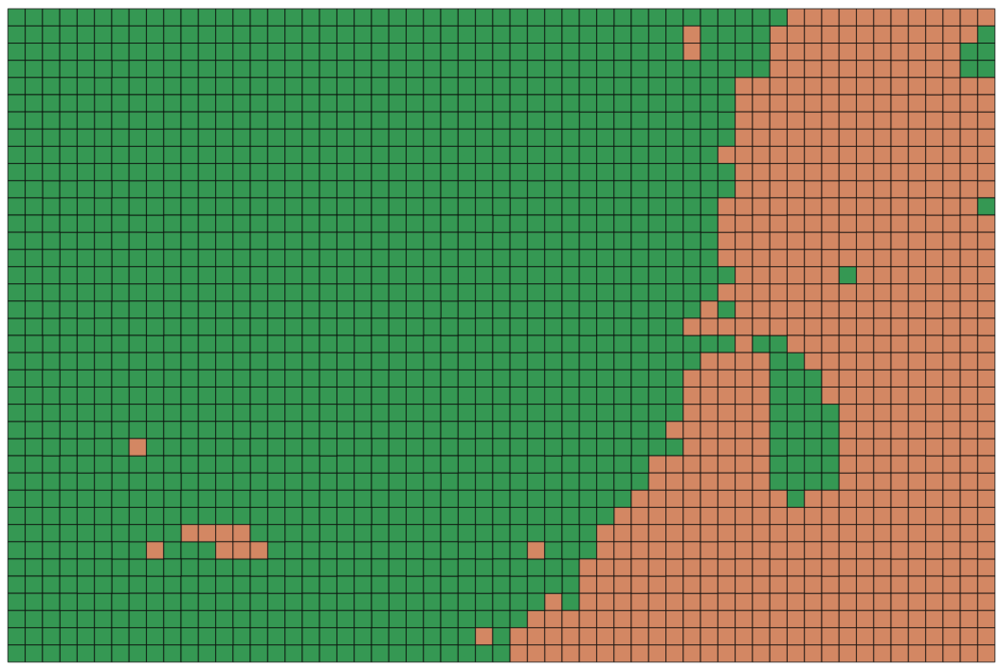
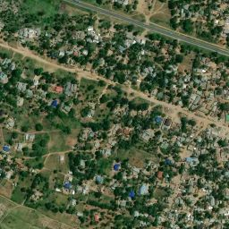

# Example Use: Creating a Neural Network to Find Populated Areas in Tanzania

Let's create a neural network to detect populated areas in Tanzania. Because there may not be a suitable dataset for this, let's use this repo to create our own. Afterwards we can use it to train a simple classifier with the data (with instructions on how to use it with custom architectures).

## Creating Training Data

First we need to define our desired data by setting up a `config.json` file. You can read more specifics about each property in the [README](../README.md#configuration).

```json
{
  "country": "united_republic_of_tanzania",
  "bounding_box": [38.83563,-6.78309,39.142055,-6.57952],
  "zoom": 16,
  "classes": [
    { "name": "Populated Area", "filter": ["has", "building"] }
  ],
  "imagery": "http://a.tiles.mapbox.com/v4/mapbox.satellite/{z}/{x}/{y}.jpg?access_token=ACCESS_TOKEN",
  "background_ratio": 1,
  "ml_type": "classification"
}
```

- `country` and `bounding_box`: the first two parameters are relatively straightforward -- we'd like to create training data in Tanzania within a specific bounding box (defined with latitude and longitude coordinates).
- `zoom`: Choosing the zoom is a bit tricker, too low and you can't see enough detail in the image, too high and you have to run your model over lots and lots of tiles to see any results. We're using `16` here after manually inspecting the imagery at http://geojson.io/.
- `classes`: There is a single class "Populated Area" which defines a [Mapbox GL Filter](https://www.mapbox.com/mapbox-gl-js/style-spec/#other-filter) to find the [appropriate OSM QA data](https://wiki.openstreetmap.org/wiki/Key:building). In this case we're using buildings as a proxy for populated areas.
- `imagery`: We'll use satellite imagery from Mapbox (remember to add your [access token](https://www.mapbox.com/help/how-access-tokens-work/))
- `ml_type`: For each tile, we're looking to determine if it contains and residential land use, so we only need to [classify](http://cs231n.github.io/classification/) the tile.
- `background_ratio`: For single-class classification problems, we need to download tiles with no classes to help the algorithm learn what makes the class distinct from other images. This ratio tells us how many "no class" images to download.

Once you've created the configuration file, you can run the following steps from the command line to create the data:

1. `label-maker download`: Download OpenStreetMap QA tiles. You can inspect the file afterwards with [mbview](https://github.com/mapbox/mbview)
2. `label-maker labels`: Create labels from the QA tiles. This will take a while since it is first retiling the tiles to zoom level 16. Then it creates the label data as `labels.npz` and file to visually inspect at `classification.geojson`. Here's what the latter looks like in QGIS (burnt orange showing the tiles with populated areas):
<p align="center">

</p>

3. `label-maker preview`: Preview the data by download example imagery for each class . Example satellite images will be at `data/examples`

<p align="center">

</p>

4. `label-maker images`: When you're ready, download all the necessary imagery tiles. Note that this will download 1,338 total images.
5. `label-maker package`: This will create a file (`data.npz`), which contains test and train data for both labels and images that's easily loaded with `numpy`.

## Training a Neural Network Classifier

### Requirements
- [Amazon Web Services Account](https://aws.amazon.com/)
- [scp](https://linux.die.net/man/1/scp)

Now that you have the necessary data, we can train a [neural network classifier](nets/resnet.py). This example uses the pre-existing [ResNet50](https://keras.io/applications/#resnet50) architecture included with Keras but feel free to try it with you own custom network.

To run the example included here:
  - [Start an EC2 instance](https://docs.aws.amazon.com/AWSEC2/latest/UserGuide/LaunchingAndUsingInstances.html) with `ami-78994d02`. This is the AWS Deep Learning image with Keras and Tensorflow installed. If you have the AWS CLI installed, you can start a [`g3.4xlarge`](https://aws.amazon.com/ec2/pricing/on-demand/) instance by running `aws ec2 run-instances --cli-input-json file://examples/utils/ec2runinst.json` (just make sure to fill the `ec2runinst.json` with your SSH key and security group name)
  - Once the instance starts, copy the network code and `data.npz` file to the instance with `scp` (replace the SSH key and IP address in the following code):
    - `scp -i ~/.ssh/your-key.pem examples/nets/resnet.py  ec2-user@1.2.3.4:/home/ec2-user/`
    - `scp -i ~/.ssh/your-key.pem data/data.npz  ec2-user@1.2.3.4:/home/ec2-user/`
  - Start the training by connecting to your instance with SSH and running `python resnet.py`. The default is to run 50 epochs with a batch size of 16.
  - Our test run of this network took about 40 minutes to train and gives a classifier with a test accuracy of ~89%. If you'd like to help improve the label accuracy, [start mapping on Open Street Map](http://www.openstreetmap.org/#map=16/-6.7749/38.9807)
