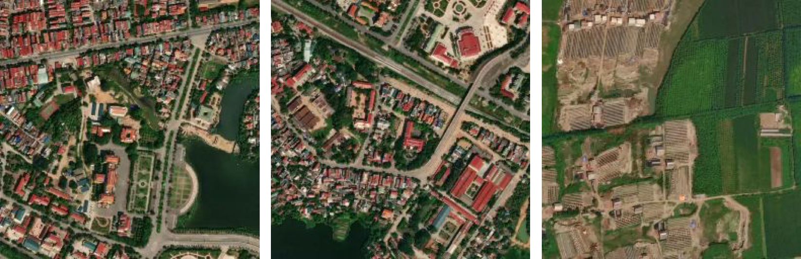
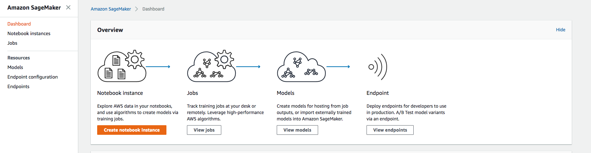

# Example Use: Creating a building classifier in Vietnam using MXNet and SageMaker

As one of the tropical countries in Asia, Vietnam has quite a variety of land use types. From the satellite imagery, you could easily spot tropical forests in dark green, deforestation patches that mix green with bare earth, rice paddy with light green and buildings with a vast variety of roof colors. It would be an interesting challenge to build a building classifier with MXNet and to train in Amazon SageMaker specifically. [Amazon SageMaker](https://aws.amazon.com/sagemaker/) is a new service from Amazon Web Services (AWS) that enables users to develop, train, deploy and scale machine learning approaches in a fairly straightforward way.

# Download Training Dataset
Before playing with SageMaker, we need to get the training dataset prepared using Label Maker.
- Install: `pip install label_maker`;
- Create Vietnam.json like shown in following json file;

```json
{
  "country": "vietnam",
  "bounding_box": [105.42,20.75,106.41,21.53],
  "zoom": 17,
  "classes": [
    { "name": "Buildings", "filter": ["has", "building"] }
  ],
  "imagery": "http://a.tiles.mapbox.com/v4/mapbox.satellite/{z}/{x}/{y}.jpg?access_token=ACCESS_TOKEN",
  "background_ratio": 1,
  "ml_type": "classification"
}
```

We're using the same configuration from [another walkthrough](../examples/walkthrough-classification-aws.md) with changes to location:
- `country` and `bounding_box`: changed to indicated the location in Vietnam to download data from.
- `zoom`: Buildings in Vietnam have quite a variety in size, so zoom 15 (roughly 5m resolution) will allow us spot building(s) in the tile.


# Training dataset generation

We'll follow the [CLI commands from the README](https://github.com/developmentseed/label-maker#command-line-use) but use a separate folder to keep our project well-managed.

```bash
$ label-maker download --dest Vietnam_building --config Vietnam.json
$ label-maker labels --dest Vietnam_building --config Vietnam.json
```

These commands will download and retile the OpenStreetMap QA tiles and use it to create our label data as `labels.npz`. We'll also get a file for inspection `classifcation.geojson`:

<p align="center">

</p>

_Purple building tile labels overlaid over [Mapbox Satellite Imagery](https://www.mapbox.com/maps/satellite/)_

Preview the data with

```bash
$ label-maker preview -n 10 --dest Vietnam_building --config Vietnam.json
```

Example satellite images will be at `Vietnam_building/examples`, and here we're showing three tiles here.

<p align="center">

</p>

When you're ready, download all 2290 imagery tiles and package it into our final file, if you wanna download less tiles you could adjust the bounding box above in the json file:

```bash
$ label-maker images --dest Vietnam_building --config Vietnam.json
$ label-maker package --dest Vietnam_building --config Vietnam.json
```

We'll use the final file `Vietnam_building/data.npz` to start training the model on Sagemaker.

# Setup Amazon Sagemaker
Here are few steps to follow if you are interested in using it to train an image classification with MXNet:
- Go to your [AWS console](https://console.aws.amazon.com)
- Log in your account and go to the [Sagemaker home page](https://console.aws.amazon.com/sagemaker/)
- Create a Notebook Instance!
<p align="center">

</p>

Click on `Create notebook Instance`. You will have three instance options, `ml.t2.medium`, `ml.m4.xlarge` and `ml.p2.xlarge` to choose from. We recommend you use the p2 machine (a GPU machine) to train this image classification.

Once you have your p2 instance notebook set up, you are ready to train a classifier. Specifically, you are going to learn how to plug your own script into Amazon SageMaker MXNet Estimator and train the classifier we prepared for detecting buildings in images.

# Train the model with MXNet on AWS SageMaker
Training a LeNet building classifier using MXNet Estimator:
- Upload the [`SageMaker_mx-lenet.ipynb` notebook](https://github.com/developmentseed/label-maker/blob/master/examples/nets/SageMaker_mx-lenet.ipynb). You can make updates to the first cell, `mx_lenet_sagemaker.py`, to customize the network architecture.
- The second cell in the notebook calls the first script as the entry-point to running SageMaker. By executing the cell you will save a `mx_lenet_sagemaker.py` to the current notebook directory in your SageMaker instance machine. We call the estimator with the following arguments:
  - The prepared script in the notebook: `mx_lenet_sagemaker.py`:
  - Your SageMaker `role` and it can be obtained with `get_execution_role`
  - The `train_instance_type`, we used and also recommend GPU instance `ml.p2.xlarge` here
  - The `train_instance_count` is equal to 1, which means we are going to train this LeNet on only one machine. You can also train the model with multiple machines using SageMaker.
  - Pass your training data to `mxnet_estimator.fit()` from a S3 bucket.
  - Using `mxnet_estimator.deploy()`, now you are using the Sagemaker MXNet model server to host your trained model.
- Now you are ready to read or download test tiles from your S3 bucket using [Boto3](https://boto3.readthedocs.io/en/latest/) like we show in the ipython notebook, and make a prediction from your trained model.
