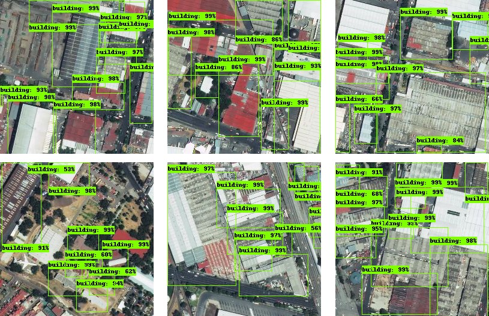
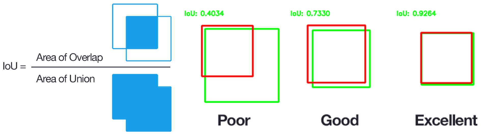

# Example Use: A building detector with TensorFlow API

Google TensorFlow Object Detection API is an open source framework built on top of TensorFlow that makes it easy to construct, train, and deploy object detection models. In this example, we use it to detect buildings in Mexico City. If you follow these steps, you'll be able to train a TensorFlow Object Detection model with the following results:

<p align="center">

</p>

First install Label Maker (`pip install label-maker`),  [tippecanoe](https://github.com/mapbox/tippecanoe) and Pandas (`pip install pandas`).

**Note:** *If you want to learn how TensorFlow object detection works and how to setup the workflow, you should follow these instructions step by step. If you want to skip the steps and automate the workflow, you can use our docker image and [follow these instructions](https://github.com/Rub21/tensorflow-building-detection) instead.*

## Create the training dataset

Mexico City  has good imagery via the Mapbox Satellite layer, so we are going to use the same configuration file we used for [another walkthrough](walkthrough-classification-mxnet-sagemaker.md), which we used to train a building classifier with MXNet and Amazon SageMaker.

Create `config.json` as shown in following JSON file.
```json
{
  "country": "mexico",
  "bounding_box": [-99.17667388916016,19.466430383606728,-99.11865234374999,19.51813278329343],
  "zoom": 17,
  "classes": [
    { "name": "Buildings", "filter": ["has", "building"] , "buffer":3}
  ],
  "imagery": "http://a.tiles.mapbox.com/v4/mapbox.satellite/{z}/{x}/{y}.jpg?access_token=ACCESS_TOKEN",
  "background_ratio": 1,
  "ml_type": "object-detection"
}
```
If you're curious about these different options, check out [the README](../README.md#configuration) or the other examples. Now that we've configured our project, we'll start with the [CLI commands](../README.md#command-line-use).

```shell
$ label-maker download
$ label-maker labels
```
These commands will first download and retile the OpenStreetMap QA tiles. Then it will create a label file in `data/labels.npz` with the bounding box for each building. Finally, you can visualize the bounding boxes in the `data/labels` folder that label maker creates.

<p align="center">

</p>

You can preview how the building bounding boxes are drawn on top of the RGB image tiles with this command:

```shell
$ label-maker preview -n 10
```
This will download ten images to the folder `data/examples/Buildings/`

<p align="center">

</p>

You can tell from the above image tiles that some buildings in Mexico City haven't been mapped yet which will impact our model prediction accuracy. If you’d like to help improve the labeling accuracy, [start mapping on OpenStreetMap](https://www.openstreetmap.org/#map=12/19.3815/-99.1653).

To download all the image tiles that contain buildings:
```shell
$ label-maker images
```
You will have 227 image tiles in your folder `data/tiles`. You don't need to run `label-maker package` for the TensorFlow Object Detection task. We'll use some custom code (included) to write the images and labels to a different format.

Now, you are ready to set up the TensorFlow Object Detection API.

## Setup TensorFlow Object Detection API

### Install TensorFlow object detection:
- Download the necessary scripts with `git clone https://github.com/tensorflow/models.git`
- Install TensorFlow Object Detection API by strictly following [these instructions](https://github.com/tensorflow/models/blob/master/research/object_detection/g3doc/installation.md). Once you've successfully run `python object_detection/builders/model_builder_test.py` you are ready for the next step.
- To access the necessary utility scripts, you'll need to run all the following commands from the `models/research/object_detection` directory from the cloned repo. **From here on we will refer the TensorFlow Object Detection directory `models/research/object_detection/` as the TOD directory.**

### Create TFRecords for model training
Tensorflow API supports a variety of file formats. The TFRecord file format is a simple record-oriented binary format that many TensorFlow applications use. We have example code in this repo which converts the `labels.npz` file to a TFRecords file:

- Copy [`tf_records_generation.py` from this repo](utils/tf_records_generation.py) to the TOD directory, .
- Copy your `labels.npz` file and `tiles` folders from `data` to the TOD directory.
- From the TOD directory run:

```shell
python tf_records_generation.py --label_input=labels.npz \
             --train_rd_path=data/train_buildings.record \
             --test_rd_path=data/test_buildings.record
```
This will create `train_buildings.record` and `test_buildings.record` files in a folder called `data` in the TOD directory. It will also copy images in your `tiles` folder to an `images` folder and split them up into two separate folders of `train` and `test`.

### Object detection model setup
Now we're ready to set up the model architecture. For this walkthrough, we'll download a pre-trained model from the [TensorFlow model zoo](https://github.com/tensorflow/models/blob/master/research/object_detection/g3doc/detection_model_zoo.md). We'll demonstrate using [`ssd_inception_v2_coco`](http://download.tensorflow.org/models/object_detection/ssd_inception_v2_coco_2017_11_17.tar.gz) (download link):
  - Download the model, unzip, and move the folder to the TOD directory
  - Create a new folder `training` in the TOD directory.
  - Copy a [model configuration file](utils/ssd_inception_v2_coco.config) to the `training directory`. If you aren't using `ssd_inception_v2_coco`, you'll need to update the configuration file to match your selected model.
  - Copy a [class definitions file](utils/building_od.pbtxt) to the `data` directory.

Now your current directory should be `models/research/object_detection/` and in addition to the files included in that repo originally, your folder structure should look like this:

```
models/research/object_detection/
├── ssd_inception_v2_coco_2017_11_17/
├── training/
│   └── ssd_inception_v2_coco.config
├── data/
│   ├── train_buildings.record
│   ├── test_buildings.record
│   └── building_od.pbtxt
└── images/
    ├── train/
    └── test/

```

# Train the TensorFlow object detection model
You are now ready to train the model. From the `models/research/object_detection` directory, run:

```shell
python train.py --logtostderr \
             --train_dir=training/ \
             --pipeline_config_path=training/ssd_inception_v2_coco.config
```
The model checkpoints and outputs for this task will save in the `training` folder. When the model is running successfully you will see:

<p align="center">

</p>

We ran this model for about **20,000 steps**, and it took **50 hours** (local CPU). If you want to run a faster model, we recommend trying `ssd_mobilenet_v1_coco` in TensorFlow model zoo, training on a GPU, or using Google's [Cloud Machine Learning Engine](https://cloud.google.com/ml-engine/).

## Visualize the Model
Create the building detection model inference graph with:

```shell
python export_inference_graph.py --input_type image_tensor \
              --pipeline_config_path training/ssd_inception_v2_coco.config \
              --trained_checkpoint_prefix training/model.ckpt-18699 \
              --output_directory building_od_ssd
```
We can visualize this graph using [`tensorboard`](https://github.com/tensorflow/tensorboard):

```shell
tensorboard --logdir='training'
```

Go to `http://127.0.0.1:6006/` in your web browser and you will see:

<p align="center">

</p>

## Prediction
Now let's run the model over our test tiles to predict where buildings are. Copy [this script](utils/tf_od_predict.py) to the TOD directory then run:

```shell
python tf_od_predict.py --model_name=building_od_ssd \
                        --path_to_label=data/building_od.pbtxt \
                        --test_image_path=images/test
```

This code will read through all your test images in `images/test` folder and output the final prediction into the same folder. You will see a final prediction like this the first graph shows above.

We also prepared a script to evaluate the model performance using intersection over union (IOU, also known [Jaccard index](https://en.wikipedia.org/wiki/Jaccard_index)).

<p align="center">

</p>

You will obtain a precision score for the model by running:

```shell
python tf_iou.py   --model_name=building_od_ssd \
                              --path_to_label=data/building_od.pbtxt \
                              --test_image_path=images/test
```

precision is when the model predicts yes, how often is it correct. When the IOU is higher than 0.5, we consider the model has predicted the buildings correctly.
