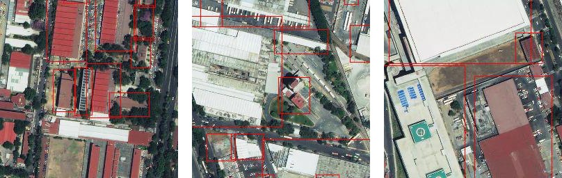

# Example Use: A building object detection with TensorFlow API

You have to walk through all these steps to be able to train a TensorFlow Object Detection and have the following results:
<p align="center">

</p>


# Download Training dataset
Vietnam has good image through Mapbox Satellite Imagery, so we are going to use the same configure JSON file we used for [another walkthrough](https://github.com/developmentseed/label-maker/blob/tf_object_detection/examples/walkthrough-classification-mxnet-sagemaker.md), which we demonstrate how to train a building classifier with MXNet and Amazon SageMaker.
- Install Label Maker by: `pip install label_maker`; and install [tippecanoe](https://github.com/mapbox/tippecanoe) .
- Create vietnam_tf.json for `object-detection` like shown in following JSON file.
```json
{
  "country": "vietnam",
  "bounding_box": [105.42,20.75,106.41,21.53],
  "zoom": 15,
  "classes": [
    { "name": "Buildings", "filter": ["has", "building"] }
  ],
  "imagery": "http://a.tiles.mapbox.com/v4/mapbox.satellite/{z}/{x}/{y}.jpg?access_token=ACCESS_TOKEN",
  "background_ratio": 1,
  "ml_type": "object-detection"
}
```
If you don't know know what is `country`, `bounding_box`, `zoom`, `classes`, `imagery`, `background_ratio` and `ml_type`, please check [the instruction at out Label Maker GitHub repository](https://github.com/developmentseed/label-maker/blob/master/README.md) or other two walkthrough examples we provided: [image classification with AWS and Keras](https://github.com/developmentseed/label-maker/blob/tf_object_detection/examples/walkthrough-classification-aws.md) and [image classification with MXNet and SageMaker](https://github.com/developmentseed/label-maker/blob/tf_object_detection/examples/walkthrough-classification-mxnet-sagemaker.md).

# Training dataset generation
We'll follow the [CLI commands from the README](https://github.com/developmentseed/label-maker#command-line-use) but use a separate folder to keep our project well-managed.

```shell
$ label-maker download --dest vietnam_building_tf --config vietnam_tf.json
$ label-maker labels --dest vietnam_building_tf --config vietnam_tf.json
```
These commands will download and retile the OpenStreetMap QA tiles, label maker will find buildings from OpenSreetMap and draw bounding box/boxes, you could visualize the tiles in your `vietnam_building_tf/labels` folder that label maker creates.
The label tiles will be saved as a numpy `labels.npz` file that you will spot in the `vietnam_building_tf`folder.
<p align="center">

</p>


You could preview how the building bounding boxes are drawn on top of the RGB image tiles by:

```shell
$ label-maker preview -n 10 --dest vietnam_building_tf --config vietnam_tf.json
```
You will see there are ten image tiles download in the folder `vietnam_building_tf/examples/Buildings/`

<p align="center">

</p>


The building bounding boxes overlaid with image tiles will look like above images.
You could tell from the above image tiles that a lot of buildings in Vietnam have been mapped and without bounding boxes yet, which would impact on our model prediction accuracy. If you’d like to help improve the labeling accuracy, [start mapping on OpenStreetMap](https://www.openstreetmap.org/#map=10/20.9755/105.4118).

To download all the image tiles that contain buildings by running
```shell
$ label-maker images --dest vietnam_building_tf --config vietnam_tf.json
```
You will have 385 image tiles in your folder `vietnam_building_tf/tiles`You don't need to run `label-maker package` for this TensorFlow Object Detection task. We have another code for you, to finish this task, and just follow the following instruction to finish the task.

Now, you are ready to set up TensorFlow object detection API

# Setup TensorFlow Object Detection API

### Install TensorFlow object detection:
- In your terminal, type in `git clone https://github.com/tensorflow/models.git`;
- Install TensorFlow Object Detection API by following strictly [this readme](https://github.com/tensorflow/models/blob/master/research/object_detection/g3doc/installation.md). You need to have everything installed, and after `python object_detection/builders/model_builder_test.py` past you will be ready to go to next step.

### Create TensoFlow TFRecords for model training
Tensorflow API supports a variety of file formats. TFRecord file format is a simple record-oriented binary format that many TensorFlow applications use. We have a python code [here on our GitHub repo](TODO...After this branch merge) for you to create TFRecords from `labels.npz` that Label Maker created after `label-maker labels` command.

Follow these steps to create TFRecards.
**From now on we will refer the TensorFlow Object Detection Directionary `models/research/object_detection/` to TOD directory.**
- Create the `tf_records_generation.py` under TOD directory,  from [our github repo](https://github.com/developmentseed/label-maker/blob/tf_object_detection/examples/utils/tf_records_generation.py), .
- Copy and paste your `labels.npz` and `tiles` folders from `vietnam_building_tf` to TOD directory too.
- From TOD directory run:

```shell
python3 tf_records_generation.py --label_input=labels.npz \
             --train_rd_path=data/train_buildings.record \
             --test_rd_path=data/test_buildings.record
```
This code will create a `train_buildings.record` and `test_buildings.record` in a folder called `data` in TOD directory. It will also copy images in your `tiles` folder to `images` folder and split them up into two separate folders of `train` and `test`.

### Object detection model setup
- download a trained model from TensorFlow. Go to [TensorFlow model zoo](https://github.com/tensorflow/models/blob/master/research/object_detection/g3doc/detection_model_zoo.md) to pick up a trained model. We used [`ssd_inception_v2_coco`](http://download.tensorflow.org/models/object_detection/ssd_inception_v2_coco_2017_11_17.tar.gz).

It's the second fastest model after `ssd_mobilenet_v1_coco`.
run this command to unzip the downloaded model:
```shell
tar -xzvf ssd_inception_v2_coco_2017_11_17.tar.gz  |  rm ssd_inception_v2_coco_2017_11_17.tar.gz
```
- [Go to our GitHub repository and create  a model configure file](https://github.com/developmentseed/label-maker/blob/tf_object_detection/examples/utils/ssd_inception_v2_coco.config) for `ssd_inception_v2_coco` as `ssd_inception_v2_coco.config`, create a folder, let's called it `training` and save this model configure in the folder.

- [Go to our GitHub repository and create  a model configure file](https://github.com/developmentseed/label-maker/blob/tf_object_detection/examples/utils/building_od.pbtxt) to get  `building_od.pbtex` too.

- if you set up the model the exact way we did here, you are good to go to train the model.

# Train the TensorFlow object detection model
You are now ready to train the model, from the `models/research/object_detection` directory, run:

```shell
python3 train.py --logtostderr \
             --train_dir=training/ \
             --pipeline_config_path=training/ssd_inception_v2_coco.config
```
We saved up all the model checkpoint and output in this task to `training` folder.
When the model is successfully run you will see:
<p align="center">

</p>

We ran this model about **10,000 steps**, and it took **37 hours**, if you wanna run a faster model, we recommend to try out `ssd_mobilenet_v1_coco` in TensorFlow model zoo.

# Create your object detection model to visualize
After the 10,000 steps, you will ready to create your own building detection model, simply run:

```shell
python3 export_inference_graph.py --input_type image_tensor \
              --pipeline_config_path training/ssd_inception_v2_coco.config \
              --trained_checkpoint_prefix training/model.ckpt-9575
              --output_directory building_od_ssd_inference_graph
```
Now we just created our building detection model inference graph, and it could visualize with `tensorboard`.
You will see the whole graph by running:

```shell
tensorboard --logdir='training'
```
go to your web browser and paste `http://127.0.0.1:6006/`, you will see.
<p align="center">

</p>


# Prediction
We created another code for you to finally run and predict any image tile you have to do the building detection. We saved the test images in a folder called `test_images`. Now [go to our Label Maker repo, copy, paste and save the code as `tf_od_predict.py`](https://github.com/developmentseed/label-maker/blob/tf_object_detection/examples/utils/tf_od_predict.py), simply run:

```shell
python3 tf_od_predict.py --model_name=building_od_ssd_inference_graph \
                                          --path_to_label=data/building_od.pbtxt \
                                          --test_image_path=test_images
```

This code will read through all your test image in `test_images` folder, and output the final prediction in the `test_images` too. You will see the final prediction like this:

<p align="center">

</p>
